# Testing Evidence for Password Manager API

This document outlines the testing of the API endpoints for the Password Manager application using Insomnia.

---

## **1. POST /passwords**

### **Add new password entries:**

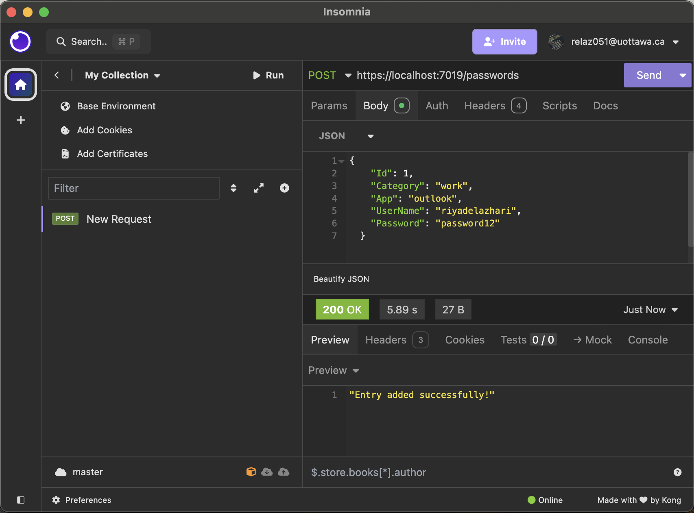
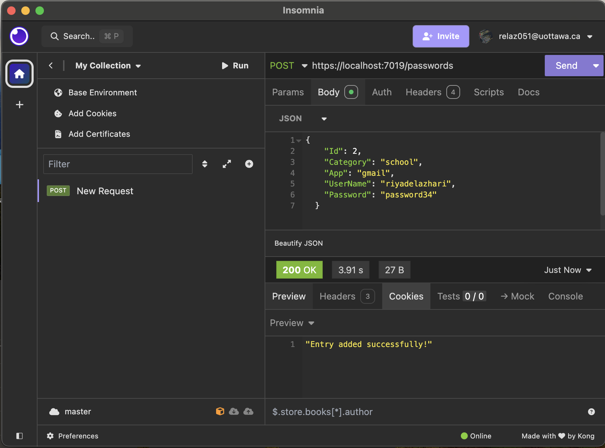

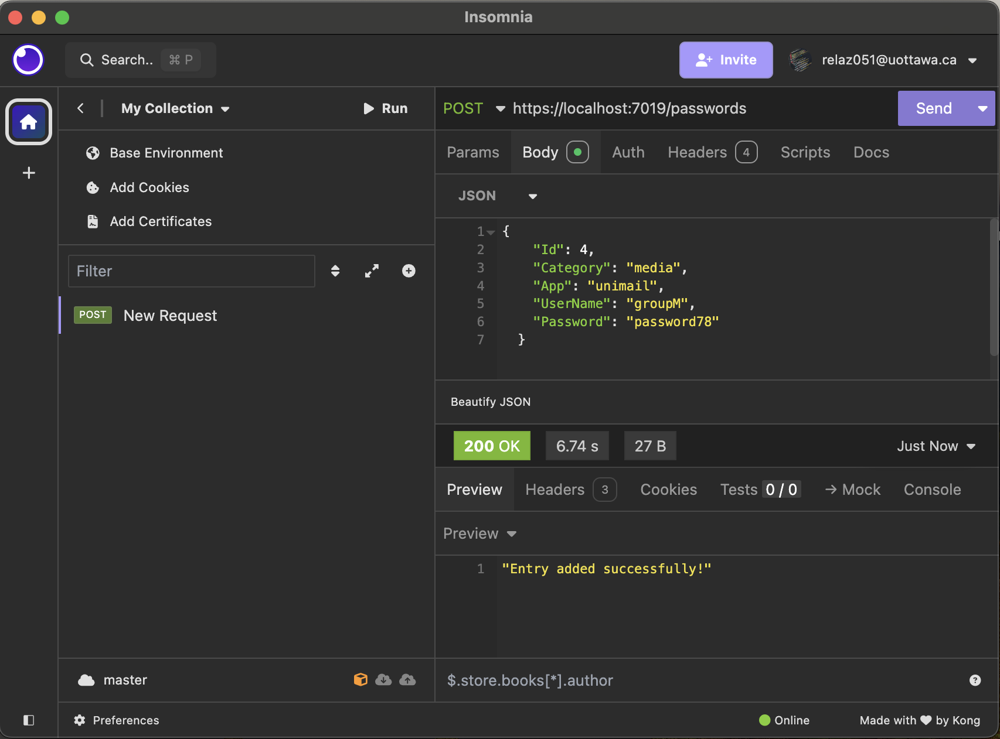

### **Add new password entry with invalid input:**

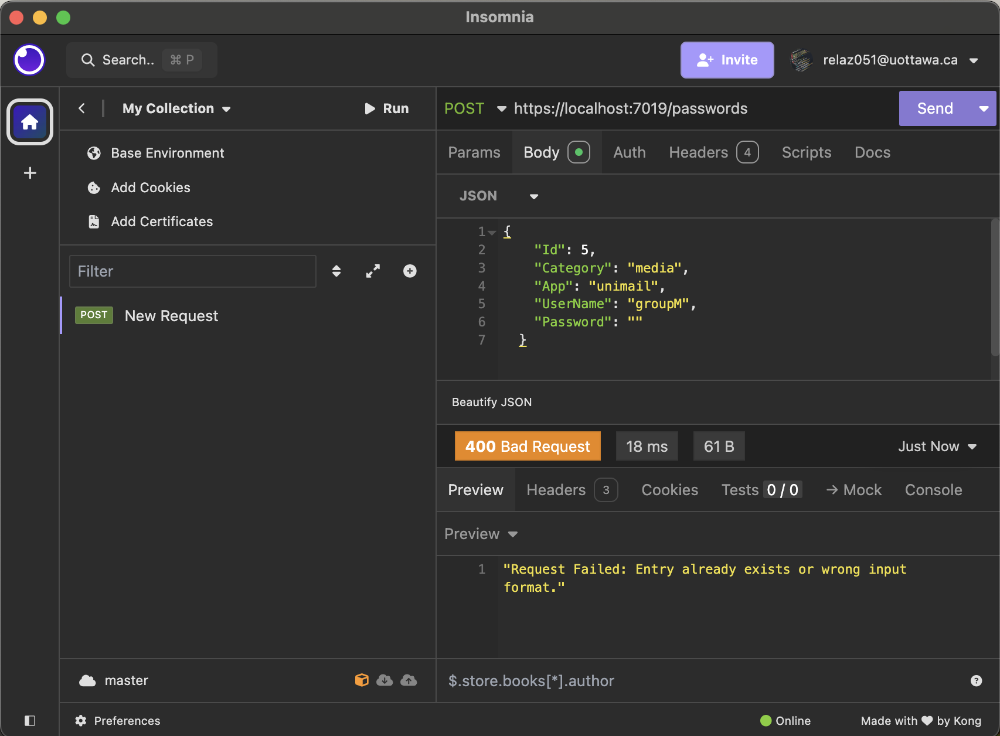

### **Add new password entry with existing id:**

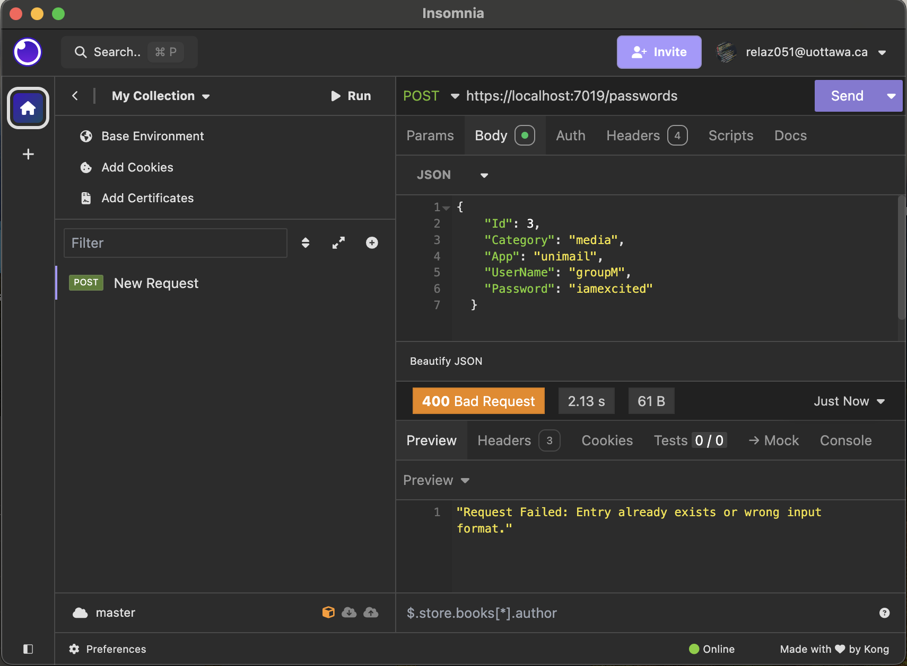

---

## **2. GET /passwords/{username}**

### **Get a password entry by username:**

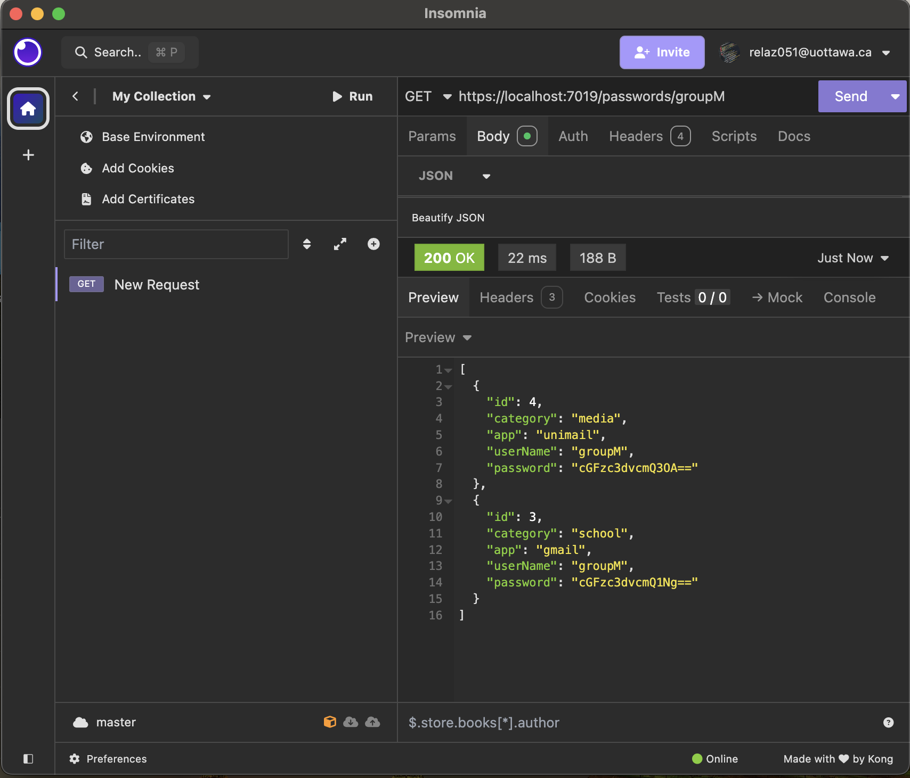

---
## **3. GET /passwords/item/{id}**

### **Get a password entry by id:**

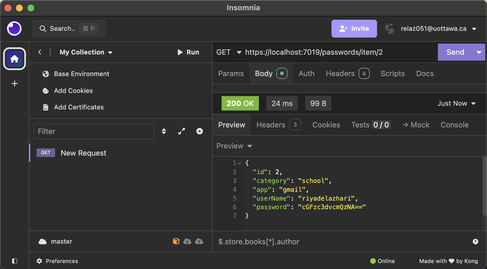

---

## **4. PUT /passwords/item/{id}**

### **Update password by id:**

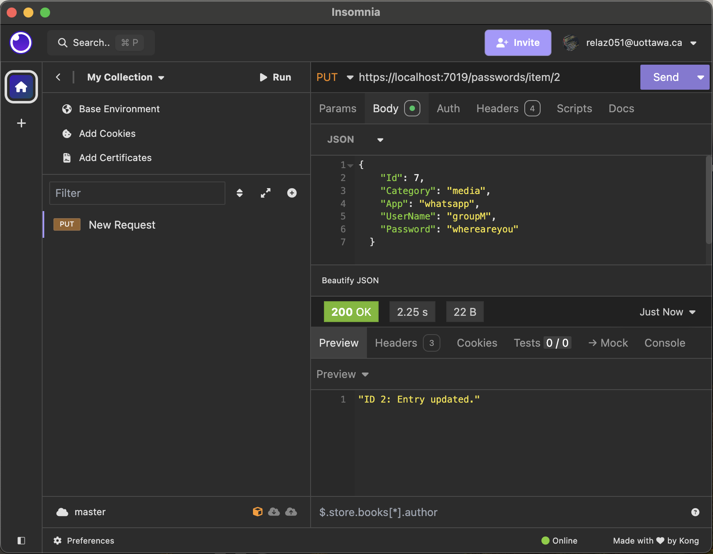

---

## **5. DELETE /passwords/item/{id}**

### **Delete password by id:**

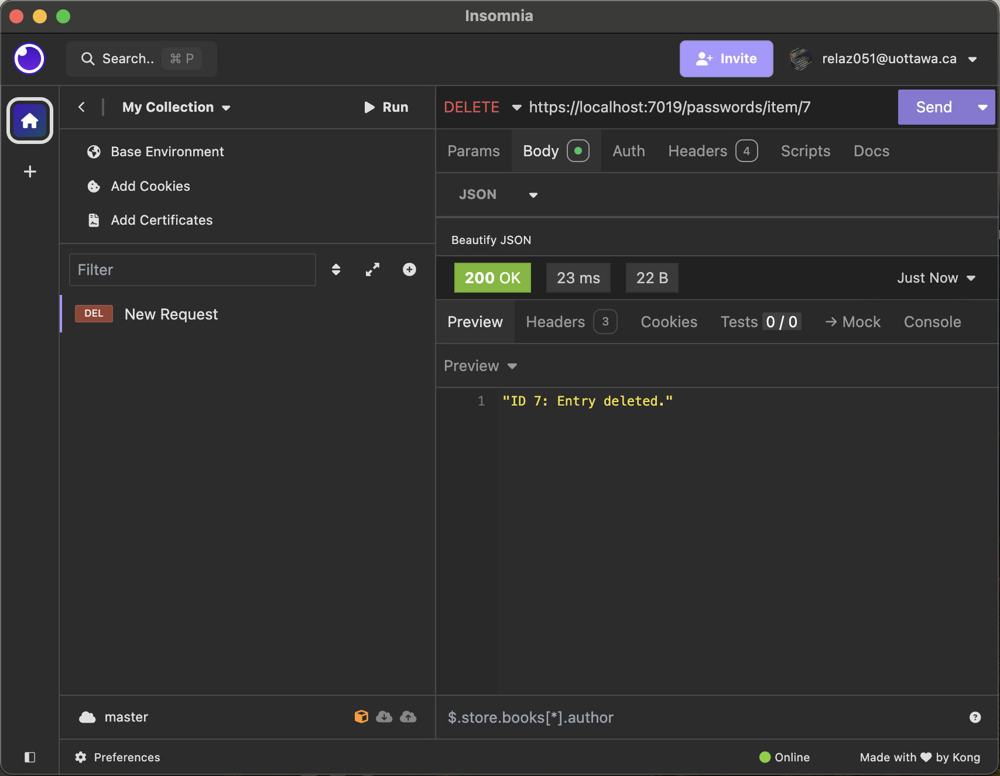
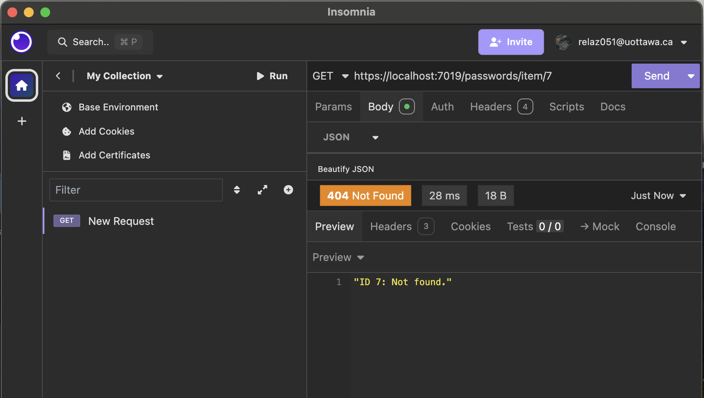

---

## **6. GET /passwords/item/{id}/decrypted**

### **Get decrypted password by id:**

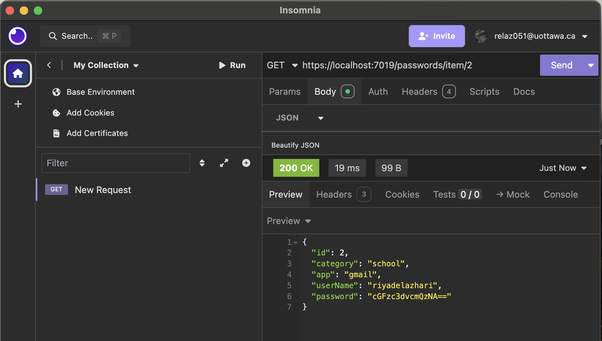
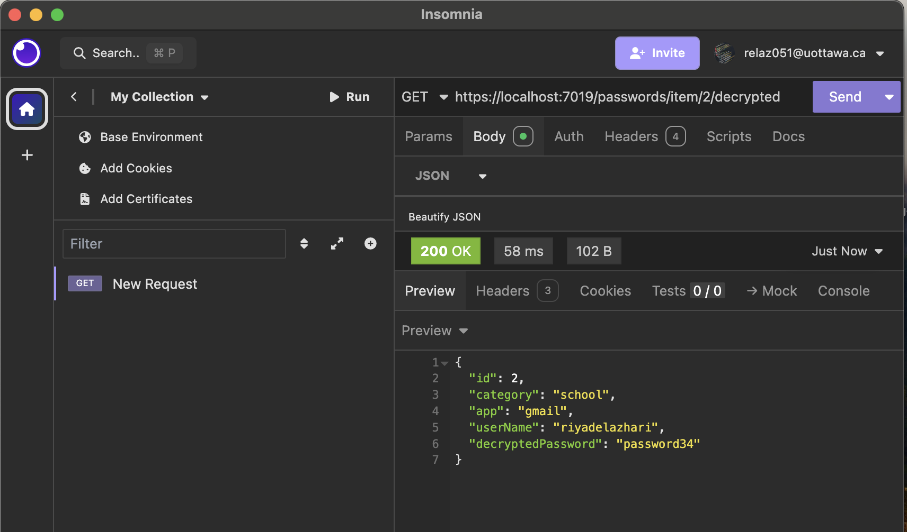

---